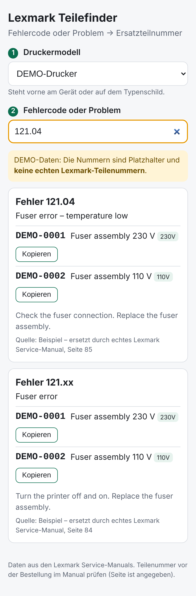

# Lexmark Teilefinder

Techniker wählt das **Druckermodell**, tippt den **Fehlercode** (z. B. `121.04`) oder beschreibt das **Problem** („Papierstau Fach 2“, „verschmiert“) – und bekommt die passende **Lexmark-Ersatzteilnummer (FRU)** mit Hinweis und Quellenangabe (Manual-Seite).

- **Kostenlos:** reine Webseite, keine KI-API, kein Server. Läuft gratis auf GitHub Pages.
- **Keine erfundenen Nummern:** Teilenummern stammen nur aus den Lexmark Service-Manuals.
- **Handy-tauglich**, merkt sich das zuletzt gewählte Modell, 230-V-Teile werden zuerst angezeigt.



> Aktuell sind nur **DEMO-Daten** enthalten (Platzhalter `DEMO-…`, keine echten Teilenummern). Echte Daten entstehen mit dem Skript unten.

## Echte Daten hinzufügen (pro Manual einmal)

1. Service-Manual des Modells als PDF von [publications.lexmark.com](https://publications.lexmark.com) bzw. dem Lexmark Partner-Portal laden und in `manuals/` legen.
2. Skript ausführen:
   ```bash
   pip install -r tools/requirements.txt
   python tools/extract.py manuals/cs72x.pdf --family cs72x \
       --models CS720,CS725,CX725 --manual "Lexmark CS72x Service Manual"
   ```
   Ein Manual gilt oft für mehrere Modelle – alle bei `--models` angeben.
3. Das Skript schreibt `docs/data/cs72x.json` und trägt die Modelle in `docs/data/index.json` ein.
4. **Stichproben prüfen:** ein paar Codes in der App suchen und mit dem PDF vergleichen. Die Zuordnung Code → Teil ist automatisch (über „Replace the …“-Schritte im Manual); Codes ohne sichere Zuordnung bekommen keine Nummer.
5. Wenn echte Daten da sind, den DEMO-Eintrag aus `docs/data/index.json` entfernen.

## Deutsche Suchbegriffe erweitern

`docs/data/synonyms.json` übersetzt Techniker-Wörter in die englischen Manual-Begriffe, z. B. `"verschmiert": ["smear", "rub"]`. Findet die Suche etwas nicht, dort ein Wort ergänzen.

## Online stellen (gratis)

GitHub → Repo → **Settings → Pages** → Source „Deploy from a branch“, Branch wählen, Ordner **`/docs`**. Die Seite ist danach unter `https://<name>.github.io/idee/` erreichbar.
GitHub Pages ist nur bei **öffentlichen** Repos gratis. Soll es privat bleiben: Cloudflare Pages (Ordner `docs`) + Cloudflare Access (Zugriff nur für bestimmte E-Mails), ebenfalls kostenlos.

## Lokal testen

```bash
python3 -m http.server -d docs 8000   # dann http://localhost:8000 öffnen
npm test                              # Suche
python3 -m unittest tests/test_extract.py   # PDF-Auslesen
```
